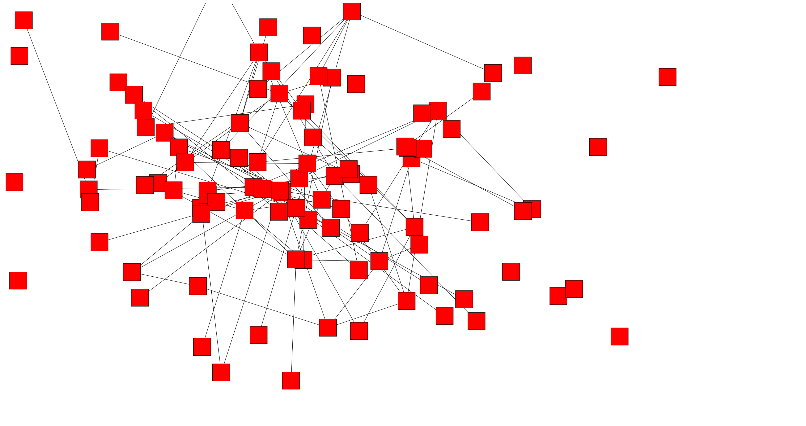

# Web Graph

This is an experiment, rendering a graph in a web browser. See for yourself:



The real thing is a bit more interactive, but you might get the idea.

## Running locally

Clone the repository and run:

```shell
cd examples/simple
trunk serve
```

Then navigate your browser to the URL shown by `trunk`.
